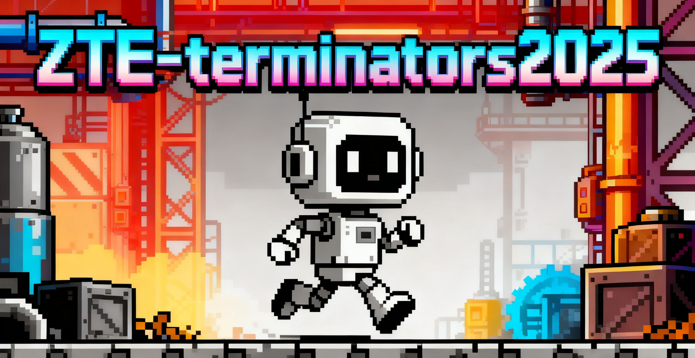

<!-- ═══════════════════════════════ HEADER ═══════════════════════════════ -->
<div align="center">
  
</div>
<!-- ═══════════════════════════ TYPING ANIMATION ══════════════════════════ -->
<div align="center">
  
</div>
<br/>
<!-- ════════════════════════════ BADGES ROW ══════════════════════════════ -->
<div align="center">
  
   
  
   
  
   
  
</div>
<br/>
---
<!-- ════════════════════════════ ABOUT SECTION ═══════════════════════════ -->
##  About Us

```yaml
Team       : ZTE Terminators
Location   : Shenzhen, China · ZTE Corporation
Mission    : General Embodied Intelligence
Flagship   : RealMirror VLA Platform ⭐ 770+
Focus      :
  - Vision-Language-Action (VLA) Models
  - Sim-to-Real Transfer (IsaacSim)
  - Open-Source Robotics Ecosystem
  - Hand Tracking & Teleoperation
Status     : Actively Building the Future 🚀
Sisyphus (Ultraworker) 
<br clear="right"/>
---
<!-- ══════════════════════════ FEATURED PROJECTS ══════════════════════════ -->
🚀 Featured Projects
<div align="center">
Project
🤖 RealMirror (https://github.com/terminators2025/RealMirror)
🖐️ Hand Tracking (https://github.com/terminators2025/RealMirror-hand-tracking-application)
🌱 Seed2Scale (https://github.com/terminators2025/Seed2Scale.github.io)
</div>
<div align="center">
RealMirror Card (https://github.com/terminators2025/RealMirror)
 
Hand Tracking Card (https://github.com/terminators2025/RealMirror-hand-tracking-application)
</div>
---
<!-- ══════════════════════════════ TECH STACK ═════════════════════════════ -->
🛠️ Tech Stack
<div align="center">
🧠 AI / Robotics
Python
PyTorch
CUDA
ROS
IsaacSim
🌐 Development
JavaScript
TypeScript
HTML5
Docker
Git
</div>
---
<!-- ════════════════════════════ GITHUB STATS ═════════════════════════════ -->
📊 GitHub Analytics
<div align="center">
  
   
  
</div>
<div align="center">
  
</div>
---
<!-- ═══════════════════════════ ACTIVITY GRAPH ════════════════════════════ -->
📈 Contribution Activity
<div align="center">
  
</div>
---
<!-- ══════════════════════════ TROPHIES ═══════════════════════════════════ -->
🏆 GitHub Trophies
<div align="center">
  
</div>
---
<!-- ═══════════════════════════════ FOOTER ═══════════════════════════════ -->
<div align="center">
💬 "The best way to predict the future is to build it."
<br/>
GitHub (https://github.com/terminators2025)
</div>
<div align="center">
  
</div>
```
---

